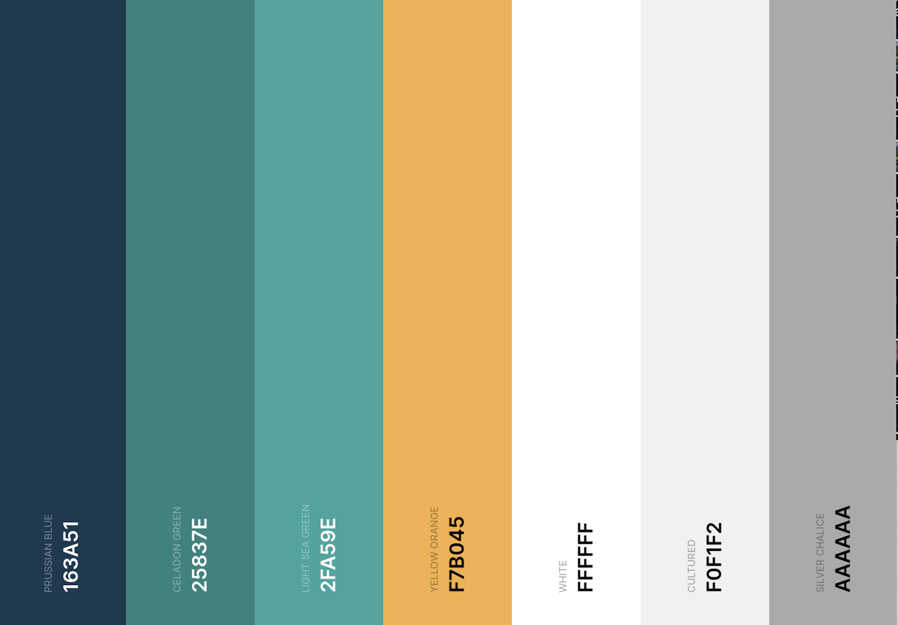

# **Campmates**

[View live version of website via GitHub Pages](https://fullstacksd.github.io/MSP2Campmates/)

A camping adventure needs some serious planning even for a really experienced adventurer. Campmates is a website that aims to serve as a checklist for individuals heading out on an adventure, helping them keep track of what the need to pack & plan before they set off on their travels. 

## **Goal for this project** 
- To be a guideline for campers so they  know what items to pack on a overnight adventure.
- To be a checklist for campers that is fully customisable. 
- To be a tool that can show campers and adventurers the items they may need to buy.
- To help people find an outdoors and camping store either online or a physical store, to purchase the things they need for their trip.

## Table of contents 
* [UX](#ux)
    * [User Persona](#user-persona)
    * [Who](#who)
    * [User Goals](#user-goals) 
    * [Site Owners Goals](#site-owners-goals) 
    * [User Stories](#user-stories)
    * [User Requirements and Expectations](#user-requirements-and-expectations)
        * [Requirements](#requirements)
        * [Expectations](#expectations)
    * [Design](#design)
        * [Icons](#icons)
        * [Colours](#colours)
        * [Logo](#logo)
* [Wireframes](#wireframes)
* [Features](#features)
    * [Existing Features](#existing-features)
    * [Features to be implemented](#features-to-be-implemented)
* [Technologies used](#technologies-used)
    * [Languages](#languages)
    * [Libraries](#libraries)
    * [Tools](#tools)
    * [Design](#design)
* [Testing](#testing)
* [Deployment](#deployment)
* [Credits](#credits)

## **UX**

### **User Persona**
This website is a tool for users interested in planning and pack for a day or an overnight camping trip mainly aimed at  beginner to intermediate campers and adenturers and those who may not be fully used to setting out on overnight adventures. This tool serves as a guide on what may be needed and also gives the induivual and idea on what they may be lacking in their own preparations to ensure the individual is well prepared before they set off on their adventure. The page is easily accesible for users and ensure they are comfortable using the checklist system. 

### **Who**
Who are we building this website for?
- Individuals hoping to  plan a day or overnight camping trip.
- Those who are starting or getting used to camping and adventuring.
- Campers who are getting prepared for their next camping adventure.

### **User Goals**
- After using the website the user should have a clear understanding of what needs to be done and able to tick items off a list
- Users should see clearly items that need to be packed and also any items thats are left to be bought
- To see the items that are already packed
- To see the items that they need to buy
- Quickly and easily find information on camping and outdoors stores (online or physical stores)
- Users are able to trust the wesbite as reviews from other users has been provided.

### **Site Owners Goals**
- Be the “go-to” planning and checklist tool for users going on a camping trip 
- Help users find camping and outdoors stores
- Contiued progression through contact with users who are asked for their feeback

### **User Stories**
* I have been going on camping adventures for a couple of years now but I still need guidance on what to pack. Sometimes I forget equipment and other times I bring too much.
* I Use a checklist when I'm preparing for an adventure as it allows me to keep track of thinmgs I have packed.
* The checklist is useful as it lets me tick items off when I have packed them so I don't repeat the same item.
* As someone who is pretty new to camping, I want to be able to list items that I still need to buy 
* After buying items that I needed that were listed on the website, I can check it off the list which is good so I don't buy something twice.
* Having the option tho look for a store is useful, especially for someone who is just starting out on the camping and adventureing scene. The list of recommended stroes is helpful.
* I want to be able to see reviews from other users to generate trust and confidence in the website.
* As a user, I want to be able to share my feedback regarding the checklist
* As a user, I want to be able to follow or connect with the creator of the site on social media

### **User Requirements and Expectations**

#### Requirements
* Easy to navigate by using the navigation menu.
* Relevant content in checklist for a camping adventure.
* Appealing visual elements.
* Easy way to contact site owner for suggestions.

#### Expectations
* When clicking on links (store and social media links), expect the page to open in a separate browser.
* Expect feedback when submitting the contact form that the form has been submitted correctly.
* Expect that the navigation links work properly to take the user where they intended to go to.
* Expect items to move from one list to another (either packed or to buy)
* Clear map of physical stores.

### **Design**
The central theme of the website is camping, therefore,  I decide to select colours and elements that represented the outdoors. For this I carried out research into images of campsites and outdoor activities for inspiration for the colour pallete.

#### Fonts
I used [Google Fonts](https://fonts.google.com/ "Google Fonts") to explore the various options.
For the overall content I have decided to use the [Roboto](https://fonts.google.com/specimen/Roboto?preview.text_type=custom") Google fonts: Roboto") font. This font is modern and easily readable.

#### Icons
I used icons from [Font Awesome library](https://fontawesome.com/ "Font Awesome"). The icons that were used were are all outdoor and nature themed or used to give emphasis to a certain section.

#### Colours
The colour scheme is based on outdoor and nature theme colours. I wanted the website ot appear  modern and clean. I used [Coolors](https://coolors.co/ "Coolors.co") to map out my colour scheme.

Colour Palette:

* #163A51: This dark blue colour is the primary colour for all headings and text. It is also the background of the main call to actions, check buttons and footer background.
* #005073: This is a deep blue colour used as an accent colour including the start button, the buy buttons and the clear/reset button.
* #2FA59E: This is a sea-green used minimally as a secondary colour for the icons in the About section.
* #F0F1F2: This is an off white/grey colour used for background blocks to break the website into sections. 
* #AAAAA: This is a light grey colour used for special icons. 

I used [Accessible Colors](https://accessible-colors.com/ "Accessible Colors") to make sure the colours in the design is at least AA compliant.

#### Logo
I found the logo on google images (https://logosear.ch/logos/freecodecamp/index.html)

#### Medium Fidelity
- [Mobile & Tablet](assets/wireframes/mobile-tablet-wireframe.png)
- [Desktop](assets/wireframes/desktop-wireframe.png)

## **Features**
- One-page site with 6 sections: Landing, About, Checklist, Find a Store, Reviews and Footer section
- There is a mobile-first focus and therefore I wanted to keep in mind first what will work on mobile. 

### Navbar
1. Logo - if clicked/ tapped - return to Landing section
2. Mobile & Tablet - User can tap the hamburger icon to open the menu with the above 6 sections
3. Desktop - Nav bar extended and the user can see page sections.
4. Nav bar - If click/tap on Logo - go to Landing Section.
5. Nav bar - If click/tap on About - go to About Section.
6. Nav bar - If click/tap on Checklist - go to Checklist Section.
7. Nav bar - If click/tap on Find a Store - go to Find a Store Section.
8. Nav bar - If click/tap on Reviews - go to Reviews Section.
9. Nav bar - If click/tap on Footer - go to Footer Section.

### Landing Section
1. User can click/tap on the start button to go directly to the Checklist section.
2. User can click/tap on chevron (down arrow) to go to the About section.

### About Section
1. Paragraph giving some background about the website for the user.
2. Icons with a summary of the main features.

### Checklist Section
1. The website allows the user to personalise their trip by providing a space for them to give their adventure a name.
2. The user can enter the campsite they are choosing name in the box provided.
3. If user click/tap on “Let's set up camp” button for the instruction box to pop up. In the Instructions box, there is an “X” which the user can tap to exit the modal and return to the main screen.
5. If the user clicks/taps on the “Clear all” button, then all the values are cleared below.
6. List of categories. If the user click/tap category in the list, a list of items for that category will display below in the “Items” list. If a category is not selected, the category items will be hidden.
7. List of items linked to a category will only display a max of 6 items. User can scroll down to view more items.
8. If the user clicks/tap on the "check" button, the item moves to the “Already Packed” list and is removed from the items list.
9. Option where the user can add their item in the box. If the user clicks on the garbage icon, the item is removed.
10. If the user clicks/tap on the "buy" button, the item moves to the “To Buy” list. If the user has packed it, they can select the "Check" button. The item moves to the “Already Packed” list and is removed from the items list.

### Find a store
1. List of links to online stores: if user click/tap on the box - new page open with the company website.
2. Display stores on Google Maps (API) with map markers.
3. If the user click/taps on markers store information displays.

### Reviews
1. Have a carousel with cards. Can click on arrows to toggle left or right.
2. Have a contact form where user can give feedback on the website.
3. Success message if the feedback form submitted successfully.
4. Clear form if message submitted successfully.
5. User and site owner get an email with emailjs (API).

### Footer
1. Social links - click/tap on social icons to open a new page to social media pages.
 

### **Existing Features**
#### Header
- Logo - Allows the user to easily recognise the brand of “Campmates”. If the user clicks on the logo, it will return the users to the “Home” section as they would expect.
- Navigation Bar - Allows the user to easily navigate the website's sections and find what they are looking for with ease and speed.

#### Hero-image
- There is a hero-image on the top of the page.

#### Specific Sections
- Landing Page Section - Allows the user to see a different social media links and created by Shannon Davidson.
- About Section - Allows the user to see a high-level page to navigate them to specific projects in her portfolio
- Checklist Section- Allows the user to select pre-populated items they have packed but also select items they add themselves. The users can also see a list of items they have already packed. 
- Still to pack & purchase Section- Allows the user to see items still to be packed. The user can add the number of items to buy and calculate the estimated cost. 
- Find a Store Section - Allows the user to find a camping store online or on Google maps if they want to go to a physical store. If they choose a physical store, the user will be able to see basic information on the store.
- Review Section - Allow user to see other users’ feedback and how they used it. It also allows the user to give their feedback.

#### Footer 
- Social Icons - Allows the user to access the social platforms that the designer & creator of the website use.

### **Features to be implemented**
- A unique environment for the user where they can sign in with a user name and password so that their information can be saved across devices - will need further skills to implement this feature.
- A feature to store documents related to a camping trip - will need further skills to implement this feature.
- Add reCAPTCHA security function in form - will need further skills to implement this feature.
- FAQ section with an accordion to view answers - Gives potential clients easy to find answers to their common questions.

## **Technologies used**

### **Languages**
- This project uses HTML, CSS and Javascript programming languages

### **Libraries & Frameworks**
- [Bootstrap](https://www.bootstrapcdn.com/)
    - The project uses **Bootstrap4** to simplify the structure of the website and help make the website responsive easy to do.
- [Font Awesome](https://fontawesome.com/)
    - The project uses Fontawesome for the icons
- [Google Fonts](https://fonts.google.com/)
    - The project uses **Google fonts** to style the website fonts.
- [Hover.css](https://cdnjs.com/libraries/hover.css/2.1.0)
    - The project uses **Hover.css** to apply hover effects to the projects navbar.
- [Popper.js](https://popper.js.org/)
    - The project uses **Popper. js** reference Javascript needed for the responsive navbar
- [Emailjs API](https://www.emailjs.com/)
    - The project uses an API from **Emailjs** for the contact form.
- [Google Maps API](https://developers.google.com/maps)
    - The project uses an API from **Google** for the map interaction and map markers

### **Tools**
- [Gitpod](https://www.gitpod.io/) - This developer used **Gitpod** for their IDE while building the website.
- [Github](https://github.com/)
    - The project uses **Github** for hosting and version control.
- [Responsinator](http://www.responsinator.com/)
    - The project used **Responsinator** to determine if the site was responsive to various devices.
- [Am I Responsive](http://ami.responsivedesign.is/#)
    - The project used **Am I Responsive** to view images of the website on different devices if the site was responsive to various devices.
- Chrome DevTools
    - For this project, the web developer tools built directly into the Google Chrome browser was used to help edit pages and diagnose problems quickly.
- [W3C Markup Validator](https://validator.w3.org/)
    - For testing HTML code
- [W3C CSS Validator](https://jigsaw.w3.org/css-validator/)
    - For testing CSS code
- [JSHint Validator](https://jshint.com/)
    - For detecting errors and potential problems in your JavaScript code
- [Link Checker](https://validator.w3.org/checklink)
    - For checking all links on the website and see if all links work
- Lighthouse in Google dev tool
    - For testing the performance of the website
- [TestProject](https://testproject.io/)
    - For automated testing of website
- [TinyPNG](https://tinypng.com/)
    - To optimise images for website loading time.

## **Testing**

Testing information can be found in separate [TESTING.md file](TESTING.md)

## **Deployment**
 
The website was deployed to GitHUb pages via the following method:

1. Navigate to the project's Setting tab in the GitHub repository.
2. On the lefthand side, scroll down to the pages tab.
3. Under the source tab, choose the branch called Main and in the drop down beside it, select the folder called Root.
4. Click Save.
5. The page automatically displays the deployed link at the top once the save is clicked.
6. It can take up to five minutes to deploy.

## Forking the GitHub Repository
By forking the GitHub Repository we make a copy of the original repository on our GitHub account to view and/or make changes without affecting the original repository by using the following steps...

Log in to GitHub and locate the GitHub Repository.
At the top of the Repository (not top of page) just above the "Settings" Button on the menu, locate the "Fork" Button.
You should now have a copy of the original repository in your GitHub account.
 

## Making a Local Clone
1. Log in to GitHub and locate the GitHub Repository.
2. Under the repository name, click "Clone or download".
3. To clone the repository using HTTPS, under "Clone with HTTPS", copy the link.
4. Open Git Bash.
5. Change the current working directory to the location where you want the cloned directory to be made.
6. Type git clone, and then paste the URL you copied.
 

### How to ensure EmailJS API works

Set up EmailJS account
1. Create an [EmailJS](https://www.emailjs.com/) account
2. Create an email template: click on the Email Template section on the left-hand side.
3. Click Create new template up at the top
4. Choose the blank template 
5. Fill in the template and say where we want the email to be sent to - click save
6. Click on the Test button up at the top

Connecting to EmailJS
1. Go to the EmailJS website then documentation
2. Click on installation and copy the EmailJS SDK
3. Copy the code and paste the code in before the closing/head tag
4. Get your user ID - you can get this from the Instructions page in the EmailJS dashboard.
5. Paste it into your emailjs.init(). You can copy your custom EmailJS code (relating to parameters) and paste it into your JavaScript.

## **Credits**

### Content
- The copy and text for this website was created by Shannon Davidson.

### Media 
- Images used are from [Pexels](https://www.pexels.com/ "Pexels")

### Code
- HTML for the navbar and form originally taken from Bootstrap with modifications for this project.
- HTML for the help modal originally taken from Bootstrap with modifications for this project.
- HTML for the Categories & Items headings feature from Bootstrap with modifications for this project.
- HMTL for the Quote Carousel from Bootstrap with modifications for this project.
- CSS for smooth scroll from https://css-tricks.com/snippets/jquery/smooth-scrolling/*/ 
- CSS for own list items from https://medium.com/@suryashakti1999/to-do-list-app-using-javascript-for-absolute-beginners-13ea9e38a033*/
- CSS for social links from Code Institute Rosie Project
- CSS for Centered section inside the top navigation original from https://www.w3schools.com/howto/howto_css_hero_image.asp*/
- JS for scroll up function from https://www.w3schools.com/howto/howto_js_scroll_to_top.asp with modifications for the project.
- JS for own list item add from https://medium.com/@suryashakti1999/to-do-list-app-using-javascript-for-absolute-beginners-13ea9e38a033 with modifications for the project.
- JS for the display of store card from https://stackoverflow.com/questions/22270664/how-to-remove-a-class-from-elements-in-pure-javascript with modifications for the project.
- JS for map markers on the map from https://developers.google.com/maps/documentation/javascript/marker-clustering#maps_marker_clustering-javascript with modifications for the project.
- JS line for storing objects in HTML5 localStorage from https://stackoverflow.com/questions/2010892/storing-objects-in-html5-localstorage
- JS line for return data and convert text into a JavaScript object from https://stackoverflow.com/questions/35273539/json-parse-from-localstorage-issue
- JS line for placing object into storage from https://stackoverflow.com/questions/2010892/storing-objects-in-html5-localstorage
- JS Function for clear localStorage from https://stackoverflow.com/questions/19246053/add-or-clear-localstorage-on-button-click-and-show-the-value-in-html
